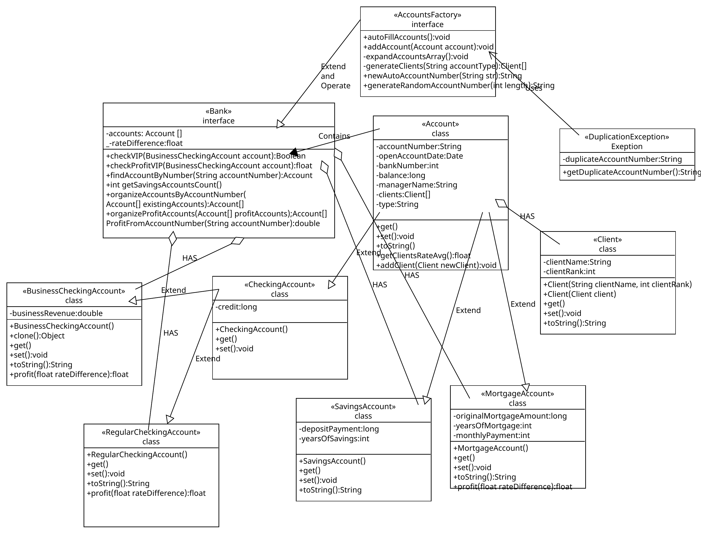

# 🏦 BankSystem-Java-OOP

A Java-based banking system that demonstrates Object-Oriented Programming (OOP) concepts such as inheritance, polymorphism, encapsulation, exception handling, and SOLID principles.

---

## 📚 Project Overview

This system allows:
- Adding clients
- Opening different types of bank accounts
- Performing operations on accounts
- Managing all data through a simple console interface

---

## 🧠 OOP Structure

- **Base class**: `Account`
- **Derived classes**:
  - `RegularCheckingAccount`
  - `BusinessCheckingAccount`
  - `MortgageAccount`
- **Client & account management**: `Bank`, `Client`
- **Factory pattern**: `AccountsFactory` – creates accounts by type
- **Custom exception**: `DuplicationException` for duplicate entities

---

## 🧱 SOLID Principles

This project follows the **SOLID** principles of object-oriented design:

- **S – Single Responsibility Principle**  
  Each class has one clear responsibility. For example, `Client` handles client data, `Bank` manages clients and accounts, and each account class handles financial operations.

- **O – Open/Closed Principle**  
  The system is open for extension but closed for modification. New account types can be added by extending `Account` and updating the `AccountsFactory`, without changing existing code.

- **L – Liskov Substitution Principle**  
  All subclasses of `Account` can be used wherever a base `Account` is expected, ensuring behavior consistency and substitution safety.

- **I – Interface Segregation Principle**  
  The system avoids forcing classes to implement methods they don’t use. Specific interfaces can be added when necessary to maintain clean, focused designs.

- **D – Dependency Inversion Principle**  
  High-level modules (like `Bank`) depend on abstractions and not on concrete implementations, achieved through the use of factory patterns and polymorphism.

---

## 📊 Class Diagram (UML)

